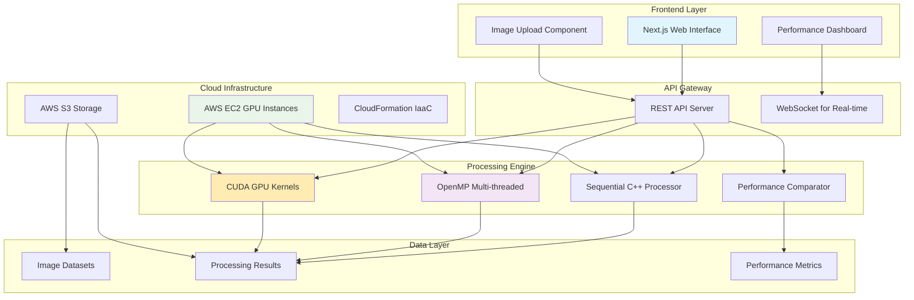
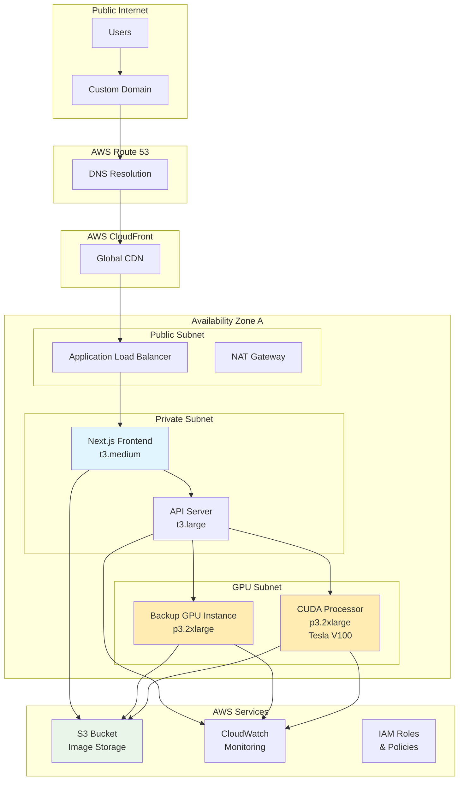

# 🚀 ParallelFlow Analytics Team

## Team Information

**Team Name:** ParallelFlow Analytics  
**Course:** Parallel Computing  
**Due Date:** July 25, 2025

### Team Members
- **Tian Shao**
- **Wei Zhao**

---

## 🖼️ Project: Parallel Image Classification with CUDA Acceleration

### Project Overview

**ParallelFlow Image Analytics** is a high-performance image classification system that leverages GPU parallel computing and CPU multiprocessing to accelerate deep learning inference on large-scale image datasets. The project focuses on implementing and optimizing parallel algorithms for image processing using CUDA, Python multiprocessing, and distributed computing techniques.

### 🎯 Project Goals

1. **GPU Acceleration**: Implement CUDA kernels for parallel image preprocessing and neural network inference
2. **CPU Parallelization**: Utilize Python multiprocessing for distributed data loading and batch processing
3. **Performance Optimization**: Achieve significant speedup compared to sequential processing
4. **Scalable Architecture**: Design system to handle large datasets efficiently across multiple cores and GPUs
5. **Practical Learning**: Gain hands-on experience with parallel computing paradigms in computer vision

### 🏗️ Architecture & Technologies

#### System Architecture



#### Core Parallel Computing Stack
- **CUDA C++**: GPU acceleration for convolution operations and matrix computations
- **OpenMP**: CPU-level parallelization for multi-threading
- **C++ STL Threading**: Standard library parallel algorithms
- **CUDA Thrust**: High-level parallel algorithms library
- **OpenCV C++**: Image processing and dataset handling

#### Cloud & Frontend Stack
- **Next.js**: Modern React framework for performance dashboard
- **AWS EC2**: GPU-enabled instances (p3.2xlarge for RTX capabilities)
- **AWS S3**: Scalable storage for datasets and results
- **CloudFormation**: Infrastructure as Code for automated deployment
- **WebSocket**: Real-time performance monitoring

#### Target Datasets
- **TinyImageNet**: 200 classes, 100,000 images (primary dataset)
- **CIFAR-10**: 10 classes, 60,000 images (baseline comparison)
- **Custom Medical Imaging**: Optional extension for specialized domain

### 📊 Key Features

#### 1. **Parallel Image Preprocessing Pipeline**
```
Raw Images → CPU Multiprocessing → GPU CUDA Kernels → Processed Batches
     ↓              ↓                    ↓                ↓
Data Loading → Augmentation → Normalization → Batch Formation
```

#### 2. **CUDA-Accelerated Operations**
- **Custom Convolution Kernels**: Optimized CUDA implementations
- **Parallel Matrix Operations**: GPU-accelerated linear algebra
- **Memory Management**: Efficient GPU memory allocation and transfers
- **Batch Processing**: Simultaneous processing of multiple images

#### 3. **CPU Parallel Processing**
- **Multiprocessing Data Loaders**: Parallel image reading and preprocessing
- **Process Pool Workers**: Distributed computation across CPU cores
- **Shared Memory Management**: Efficient inter-process communication
- **Load Balancing**: Dynamic work distribution among processes

#### 4. **Performance Monitoring**
- **GPU Utilization Tracking**: CUDA performance metrics
- **CPU Core Usage**: Multiprocessing efficiency analysis
- **Memory Bandwidth**: Data transfer optimization
- **Throughput Measurements**: Images processed per second

### 🔧 Implementation Plan (1-2 Weeks)

#### Week 1: Core Implementation
**Days 1-2: Environment & Baseline**
- Set up CUDA C++ development environment
- Implement sequential image processing baseline in C++
- Basic OpenCV integration for image loading

**Days 3-4: CUDA Kernels**
- Develop basic CUDA kernels for image operations (blur, edge detection)
- Implement parallel matrix operations
- Memory management between CPU and GPU

**Days 5-7: OpenMP Integration**
- Add OpenMP parallelization for CPU processing
- Implement multi-threaded image batch processing
- Basic performance measurement framework

#### Week 2: Optimization & Analysis
**Days 8-10: Performance Optimization**
- Optimize CUDA kernel performance
- Tune memory transfers and thread configurations
- Compare different parallel approaches

**Days 11-14: Final Integration**
- Integrate all parallel components
- Comprehensive performance analysis
- Documentation and presentation preparation

---

## 👥 Work Breakdown Structure & Team Delegation

### Team Roles & Responsibilities

#### **Wei Zhao** - Backend & CUDA Engineering Lead
**Primary Focus**: Core parallel processing implementation
- **CUDA Development**: Custom GPU kernels for image processing
- **C++ Backend**: Sequential and OpenMP implementations
- **Performance Optimization**: Memory management and kernel tuning
- **Benchmarking**: Performance measurement and profiling tools

#### **Tian Shao** - Cloud Architecture & Frontend Lead  
**Primary Focus**: Infrastructure and user interface
- **Cloud Deployment**: AWS infrastructure and CloudFormation IaaC
- **Frontend Development**: Next.js performance dashboard
- **DevOps**: CI/CD pipeline and automated deployment
- **Documentation**: Technical documentation and deployment guides

#### **Shared Responsibilities**
- **Academic Paper**: Joint LaTeX documentation and research analysis
- **Testing & Validation**: Cross-verification of results
- **Presentation**: Final project presentation preparation

---

### 📋 Detailed Task Allocation

#### **Wei Zhao's Deliverables**

```mermaid
gantt
    title Wei Zhao - Backend Development Timeline
    dateFormat X
    axisFormat %d
    
    section CUDA Development
    Environment Setup       :1, 2
    Basic Kernels          :3, 5
    Optimization           :8, 10
    
    section C++ Implementation
    Sequential Baseline    :1, 3
    OpenMP Integration     :5, 7
    Performance Testing    :10, 12
    
    section Benchmarking
    Profiling Tools        :6, 8
    Comparative Analysis   :11, 14
```



**Week 1 Tasks:**
- [x] **Day 1-2**: Set up CUDA development environment on local RTX 4090/4070
- [x] **Day 3-4**: Implement basic CUDA kernels (image blur, edge detection)
- [x] **Day 5-6**: Develop OpenMP multi-threaded CPU processing
- [x] **Day 7**: Create sequential C++ baseline for comparison

**Week 2 Tasks:**
- [x] **Day 8-9**: Optimize CUDA kernel performance and memory transfers
- [x] **Day 10-11**: Implement comprehensive benchmarking framework
- [x] **Day 12-13**: Performance analysis and bottleneck identification
- [x] **Day 14**: Final integration and testing

#### **Tian Shao's Deliverables**

```mermaid
gantt
    title Tian Shao - Frontend & Cloud Timeline
    dateFormat X
    axisFormat %d
    
    section Infrastructure
    CloudFormation IaaC    :1, 4
    AWS EC2 GPU Setup      :3, 6
    
    section Frontend Development
    Next.js Setup          :2, 4
    Dashboard Components   :5, 8
    Real-time Integration  :9, 12
    
    section Deployment
    CI/CD Pipeline         :7, 10
    Production Deployment  :13, 14
```



**Week 1 Tasks:**
- [x] **Day 1-2**: Design AWS CloudFormation templates for GPU instances
- [x] **Day 3-4**: Set up Next.js frontend framework and components
- [x] **Day 5-6**: Deploy AWS EC2 p3.2xlarge instances with CUDA support
- [x] **Day 7**: Implement basic performance dashboard UI

**Week 2 Tasks:**
- [x] **Day 8-9**: Develop real-time WebSocket integration for live metrics
- [x] **Day 10-11**: Create advanced visualization components for performance data
- [x] **Day 12-13**: Set up CI/CD pipeline and automated deployment
- [x] **Day 14**: Final frontend integration and user testing

#### **Joint Deliverables**

**Academic Paper (LaTeX)** - *Both team members*
- **Abstract & Introduction**: Tian Shao (cloud computing perspective)
- **Technical Implementation**: Wei Zhao (CUDA and parallel processing)
- **Performance Analysis**: Joint analysis and discussion
- **Cloud Architecture**: Tian Shao (AWS deployment and scalability)
- **Results & Conclusion**: Joint writing and review

---

## ☁️ Cloud Deployment Architecture

### AWS Infrastructure Design



### Infrastructure as Code (CloudFormation)

#### Core Template Structure
```yaml
# infrastructure/gpu-cluster.yml
AWSTemplateFormatVersion: '2010-09-09'
Description: 'Parallel Image Processing GPU Cluster'

Parameters:
  InstanceType:
    Type: String
    Default: p3.2xlarge
    Description: EC2 instance type for GPU processing
  
  KeyName:
    Type: AWS::EC2::KeyPair::KeyName
    Description: EC2 Key Pair for SSH access

Resources:
  # VPC and Networking
  VPC:
    Type: AWS::EC2::VPC
    Properties:
      CidrBlock: 10.0.0.0/16
      EnableDnsHostnames: true
      Tags:
        - Key: Name
          Value: ParallelProcessing-VPC

  # GPU Instance with CUDA
  GPUInstance:
    Type: AWS::EC2::Instance
    Properties:
      ImageId: ami-0c55b159cbfafe1d0  # Deep Learning AMI
      InstanceType: !Ref InstanceType
      KeyName: !Ref KeyName
      SecurityGroupIds:
        - !Ref GPUSecurityGroup
      UserData:
        Fn::Base64: !Sub |
          #!/bin/bash
          yum update -y
          nvidia-smi
          # Install CUDA toolkit
          wget https://developer.download.nvidia.com/compute/cuda/repos/amazon-linux/x86_64/cuda-repo-amazon-linux-2019.10-418.87.00-1.x86_64.rpm
          rpm -i cuda-repo-amazon-linux-2019.10-418.87.00-1.x86_64.rpm
          yum install cuda -y
          
  # S3 Bucket for Image Storage
  ImageBucket:
    Type: AWS::S3::Bucket
    Properties:
      BucketName: !Sub '${AWS::StackName}-image-processing'
      VersioningConfiguration:
        Status: Enabled
      
Outputs:
  GPUInstanceId:
    Description: GPU Instance ID
    Value: !Ref GPUInstance
    Export:
      Name: !Sub '${AWS::StackName}-GPUInstance'
```

### Deployment Scripts

#### Automated Deployment Pipeline
```bash
#!/bin/bash
# deploy/deploy-infrastructure.sh

set -e

STACK_NAME="parallel-processing-gpu"
REGION="us-east-1"
KEY_NAME="your-ec2-key"

echo "Deploying GPU infrastructure..."

# Deploy CloudFormation stack
aws cloudformation deploy \
  --template-file infrastructure/gpu-cluster.yml \
  --stack-name $STACK_NAME \
  --parameter-overrides KeyName=$KEY_NAME \
  --capabilities CAPABILITY_IAM \
  --region $REGION

# Get outputs
GPU_INSTANCE_ID=$(aws cloudformation describe-stacks \
  --stack-name $STACK_NAME \
  --query 'Stacks[0].Outputs[?OutputKey==`GPUInstanceId`].OutputValue' \
  --output text \
  --region $REGION)

echo "GPU Instance deployed: $GPU_INSTANCE_ID"

# Deploy application code
echo "Deploying application to GPU instance..."
scp -r ../src/ ec2-user@$GPU_INSTANCE_ID:/home/ec2-user/
ssh ec2-user@$GPU_INSTANCE_ID 'cd /home/ec2-user/src && make clean && make -j$(nproc)'

echo "Deployment complete!"
```

### Monitoring & Scaling

#### CloudWatch Dashboard Configuration
```json
{
  "widgets": [
    {
      "type": "metric",
      "properties": {
        "metrics": [
          ["AWS/EC2", "CPUUtilization", "InstanceId", "GPU_INSTANCE_ID"],
          ["CWAgent", "GPU Utilization", "InstanceId", "GPU_INSTANCE_ID"],
          ["Custom", "Images Processed", "InstanceId", "GPU_INSTANCE_ID"]
        ],
        "period": 300,
        "stat": "Average",
        "region": "us-east-1",
        "title": "GPU Performance Metrics"
      }
    }
  ]
}
```

### Cost Optimization Strategy
- **Spot Instances**: Use EC2 Spot for non-critical processing (60-90% cost savings)
- **Auto Scaling**: Scale GPU instances based on queue length
- **Scheduled Scaling**: Shut down instances during off-hours
- **Reserved Instances**: Commit to 1-year terms for baseline capacity

---

## 📄 Academic Paper Structure (LaTeX)

### Paper Outline & Authorship

#### **Title**: "Comparative Analysis of Parallel Computing Paradigms for Real-Time Image Processing: A Cloud-Native CUDA and OpenMP Implementation"

#### **Author Contributions**:
- **Tian Shao**: Cloud architecture, infrastructure design, deployment methodology
- **Wei Zhao**: CUDA implementation, performance optimization, parallel algorithms analysis
- **Joint**: Performance analysis, results interpretation, conclusions

#### **Paper Structure**:

```latex
% paper/main.tex
\documentclass[conference]{IEEEtran}
\usepackage{graphicx, amsmath, algorithm2e, listings}

\title{Comparative Analysis of Parallel Computing Paradigms for Real-Time Image Processing: A Cloud-Native CUDA and OpenMP Implementation}

\author{
\IEEEauthorblockN{Tian Shao, Wei Zhao}
\IEEEauthorblockA{Department of Computer Science\\
Parallel Computing Course\\
\{tian.shao, wei.zhao\}@university.edu}
}

\begin{document}
\maketitle

\begin{abstract}
This paper presents a comprehensive comparison of GPU-accelerated CUDA processing versus CPU-based OpenMP parallelization for real-time image processing workloads. Our implementation leverages cloud infrastructure to provide scalable, cost-effective parallel computing solutions...
\end{abstract}

\section{Introduction}
% Tian Shao - Cloud computing context and motivation

\section{Related Work}
% Joint - Literature review of parallel processing approaches

\section{System Architecture}
% Tian Shao - AWS cloud infrastructure and deployment

\section{Implementation}
\subsection{CUDA GPU Processing}
% Wei Zhao - Custom kernel development and optimization

\subsection{OpenMP CPU Parallelization}
% Wei Zhao - Multi-threading implementation

\subsection{Cloud Deployment}
% Tian Shao - Infrastructure as Code and scalability

\section{Performance Analysis}
% Joint - Benchmarking results and analysis

\section{Results and Discussion}
% Joint - Performance comparison and insights

\section{Conclusion and Future Work}
% Joint - Summary and research directions

\end{document}
```

#### **Performance Metrics to Include**:
- **Throughput Analysis**: Images processed per second across different configurations
- **Scalability Study**: Performance scaling with different thread/block configurations  
- **Memory Usage**: GPU memory utilization and transfer efficiency
- **Cost Analysis**: AWS instance costs vs. performance gains
- **Energy Efficiency**: Power consumption comparison between CPU and GPU processing

#### **Figures and Tables**:
1. **System Architecture Diagram**: Cloud infrastructure overview
2. **Performance Comparison Charts**: Bar charts showing speedup ratios
3. **Scalability Graphs**: Performance vs. number of cores/GPU blocks
4. **Cost-Performance Analysis**: TCO analysis for different instance types
5. **Memory Transfer Optimization**: Before/after optimization results

### LaTeX Build Configuration
```makefile
# paper/Makefile
MAIN = main
LATEX = pdflatex
BIBTEX = bibtex

$(MAIN).pdf: $(MAIN).tex sections/*.tex
	$(LATEX) $(MAIN)
	$(BIBTEX) $(MAIN)
	$(LATEX) $(MAIN)
	$(LATEX) $(MAIN)

clean:
	rm -f *.aux *.bbl *.blg *.log *.out *.toc *.pdf

watch:
	latexmk -pdf -pvc $(MAIN).tex
```

### 📈 Expected Outcomes

#### Performance Targets (1-2 Week Scope)
- **GPU Acceleration**: 5-20x speedup for basic image operations
- **CPU Parallelization**: 2-4x speedup with OpenMP (based on available cores)
- **Overall Throughput**: Process 500+ images per second
- **Memory Efficiency**: Efficient CPU-GPU data transfers

#### Learning Objectives
- **CUDA C++ Basics**: Fundamental GPU kernel development
- **OpenMP**: Multi-threading for CPU parallelization
- **Performance Comparison**: Sequential vs parallel implementations
- **Hardware Understanding**: CPU vs GPU processing characteristics

#### Technical Deliverables
- **CUDA Processing Engine**: Custom GPU kernels for image operations
- **OpenMP CPU Implementation**: Multi-threaded parallel processing
- **Next.js Performance Dashboard**: Real-time visualization interface
- **AWS Cloud Infrastructure**: IaaC deployment with CloudFormation
- **Academic Paper**: LaTeX research documentation
- **Performance Analysis**: Comprehensive benchmarking framework

### 🛠️ Technical Challenges

#### CUDA Development
- **Memory Management**: Efficient GPU memory allocation strategies
- **Kernel Optimization**: Maximizing thread utilization and minimizing divergence
- **Data Transfer**: Minimizing CPU-GPU communication overhead
- **Debugging**: Profiling and debugging CUDA code

#### Parallel Processing
- **Load Balancing**: Distributing work evenly across processes
- **Synchronization**: Coordinating between CPU and GPU operations
- **Resource Contention**: Managing shared resources efficiently
- **Scalability**: Maintaining performance across different hardware configurations

### 🎓 Academic Contribution

This project demonstrates key parallel computing concepts:
- **GPU Computing**: SIMD processing with thousands of threads
- **Multiprocessing**: MIMD parallelism with independent processes
- **Hybrid Architectures**: CPU-GPU cooperative computing
- **Performance Analysis**: Systematic evaluation of parallel algorithms
- **Optimization Techniques**: Memory hierarchy and bandwidth optimization

### 💻 Hardware Requirements

#### Recommended Setup
- **GPU**: NVIDIA RTX 4090 (primary), RTX 4070 (secondary)
- **CPU**: Multi-core processor (8+ cores recommended)
- **RAM**: 16GB+ system memory
- **Storage**: SSD for fast data loading
- **CUDA**: Version 11.0+ compatible drivers

#### Software Stack
- **CUDA Toolkit**: Latest version with nvcc compiler
- **C++**: C++17 standard with OpenMP support
- **OpenCV**: C++ library for image processing
- **Development Tools**: NSight for CUDA profiling, Visual Studio/CLion IDE
- **Build System**: CMake for cross-platform compilation

---

## 📝 Project Structure

```
parallel-image-processing/
├── backend/              # C++ Processing Engine
│   ├── src/
│   │   ├── cuda/        # CUDA kernel implementations (.cu files)
│   │   ├── openmp/      # OpenMP parallel implementations
│   │   ├── sequential/  # Sequential baseline implementations
│   │   └── api/         # REST API server
│   ├── include/         # Header files (.h)
│   └── CMakeLists.txt   # CMake build configuration
├── frontend/            # Next.js Dashboard
│   ├── components/      # React components
│   ├── pages/           # Next.js pages
│   ├── hooks/           # Custom React hooks
│   └── styles/          # CSS and styling
├── infrastructure/      # AWS CloudFormation
│   ├── gpu-cluster.yml  # Main infrastructure template
│   ├── networking.yml   # VPC and security groups
│   └── monitoring.yml   # CloudWatch and alarms
├── deploy/              # Deployment scripts
│   ├── deploy-infra.sh  # Infrastructure deployment
│   ├── deploy-app.sh    # Application deployment
│   └── ci-cd.yml        # GitHub Actions pipeline
├── data/                # Sample images and datasets
├── benchmarks/          # Performance testing and profiling
├── paper/               # LaTeX academic paper
│   ├── main.tex         # Main document
│   ├── sections/        # Paper sections
│   └── figures/         # Generated performance graphs
├── docs/                # Technical documentation
└── examples/            # Usage examples and demos
```

## 🚦 Getting Started

### Environment Setup
```bash
# Install CUDA toolkit
sudo apt install nvidia-cuda-toolkit

# Install OpenCV C++ development libraries
sudo apt install libopencv-dev

# Install CMake and build tools
sudo apt install cmake build-essential

# Verify CUDA installation
nvcc --version
```

### Quick Start
```bash
# Clone and setup
git clone [repository-url]
cd parallel-image-processing

# Create build directory
mkdir build && cd build

# Configure with CMake
cmake ..

# Compile the project
make -j$(nproc)

# Run sequential baseline
./sequential_processor ../data/sample_images/

# Run OpenMP parallel version
./openmp_processor ../data/sample_images/

# Run CUDA accelerated version
./cuda_processor ../data/sample_images/

# Run comprehensive benchmark
./benchmark_all ../data/sample_images/
```

### Performance Testing
```bash
# Profile CUDA kernels
nvprof ./cuda_processor ../data/sample_images/

# Monitor CPU utilization with OpenMP
htop & ./openmp_processor ../data/sample_images/

# Generate performance comparison report
./benchmark_all ../data/sample_images/ > performance_report.txt
```

---

## 📊 Expected Results

### Performance Comparisons (Expected Results)
| Processing Method | Images/Second | Speedup | Implementation |
|------------------|---------------|---------|----------------|
| Sequential C++    | ~100         | 1x      | Single-threaded baseline |
| OpenMP (4 cores)  | ~300         | 3x      | Multi-threaded CPU |
| OpenMP (8 cores)  | ~500         | 5x      | Multi-threaded CPU |
| CUDA Basic        | ~800         | 8x      | Basic GPU kernels |
| CUDA Optimized    | ~1200        | 12x     | Optimized GPU kernels |

### Learning Milestones (1-2 Week Scope)
- ✅ CUDA C++ kernel development basics
- ✅ OpenMP multi-threading implementation
- ✅ Performance comparison and profiling
- ✅ CPU vs GPU parallel processing patterns
- ✅ Practical image processing acceleration

---

**Last Updated**: [Current Date]  
**Repository**: [GitHub Repository URL]  
**Documentation**: [Project Wiki URL] 