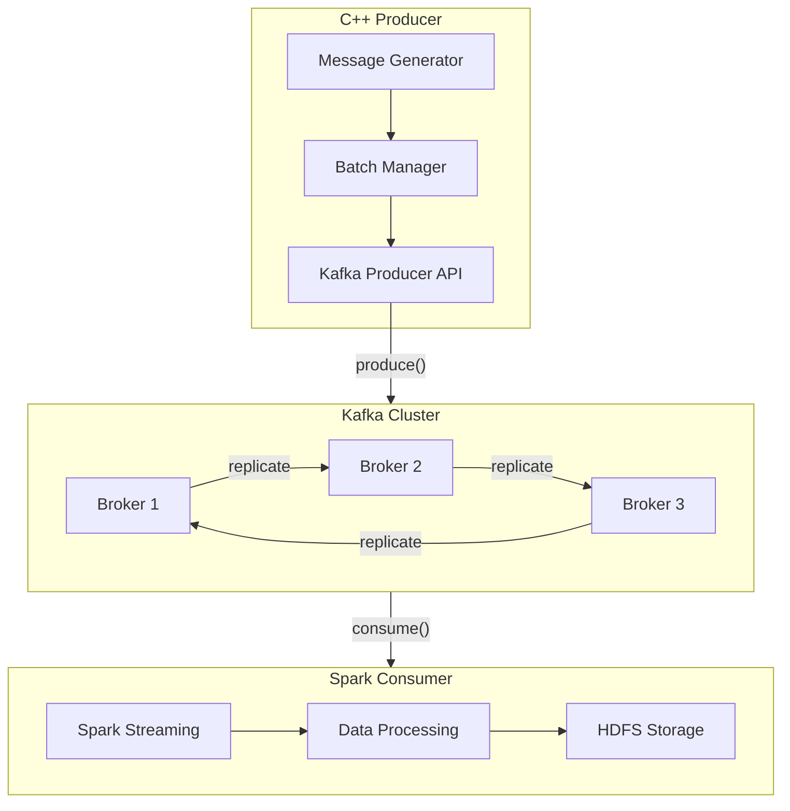
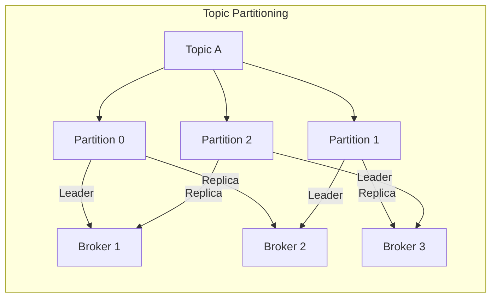
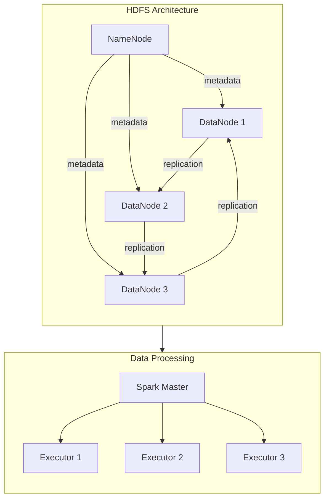
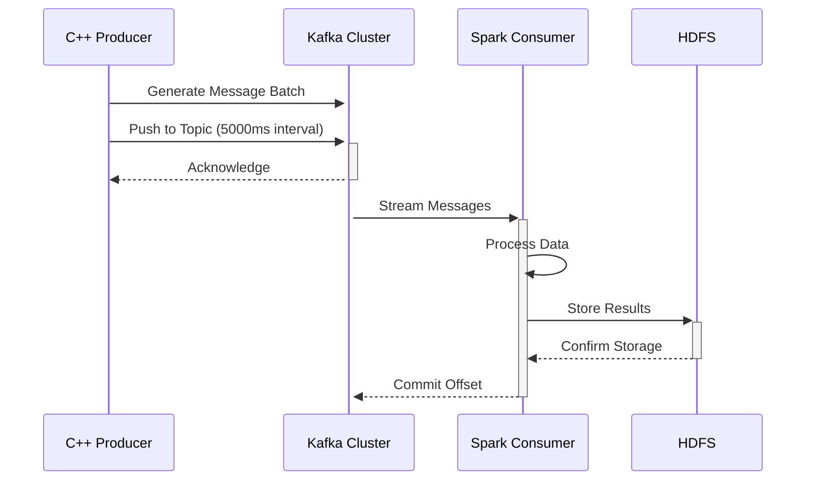
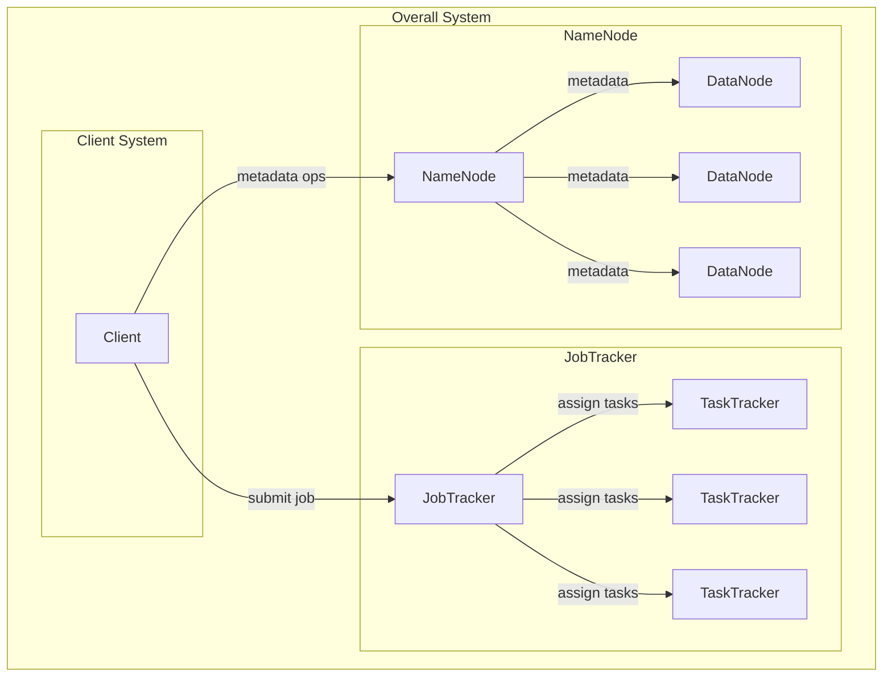
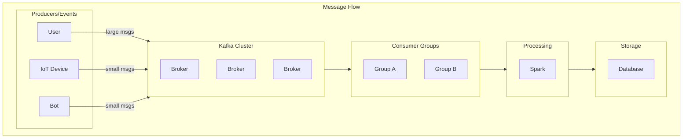

# Parallel Computing and Distributed Systems Architecture Guide

## Table of Contents
1. [System Architecture Diagrams](#system-architecture-diagrams)
2. [Apache Kafka Architecture](#apache-kafka-architecture)
3. [Message Processing Strategies](#message-processing-strategies)
4. [Spark Integration](#spark-integration)
5. [Hadoop Distributed Architecture](#hadoop-distributed-architecture)
6. [C++ Producer Implementation](#cpp-producer-implementation)

## System Architecture Diagrams

### Overall System Architecture


### Kafka Topic Partitioning


### HDFS and Spark Architecture


### Message Flow Sequence


## Apache Kafka Architecture

### Core Components
- **Broker Cluster**: Multiple brokers working together for scalability and fault tolerance
  - Recommended: 3-5 brokers for medium workloads
  - 5+ brokers for high-availability production environments

- **Topics and Partitions**:
  ```
  Topic A
  ├── Partition 0 (Leader: Broker 1, Replicas: 2,3)
  ├── Partition 1 (Leader: Broker 2, Replicas: 1,3)
  └── Partition 2 (Leader: Broker 3, Replicas: 1,2)
  ```

### Message Size Considerations

#### Large Messages (>1MB)
- **Configuration Settings**:
  ```properties
  message.max.bytes=10485760          # 10MB max message size
  replica.fetch.max.bytes=10485760
  fetch.message.max.bytes=10485760
  ```
- **Partitioning Strategy**: Hash-based on key for even distribution
- **Recommended Topic Settings**:
  ```properties
  num.partitions=12
  replication.factor=3
  ```

#### Small Messages (<100KB)
- **Batch Settings**:
  ```properties
  batch.size=64KB
  linger.ms=50
  ```
- **Producer Configurations**:
  ```properties
  compression.type=snappy
  acks=1
  ```

### Consumer Groups
- **Group Configuration**:
  ```properties
  group.id=spark-consumer-group
  auto.offset.reset=earliest
  enable.auto.commit=false
  ```

## Message Processing Strategies

### Large Message Processing
1. **Chunking Strategy**:
   - Split messages >5MB into chunks
   - Use message headers for chunk identification
   - Reassemble at consumer side

2. **Compression**:
   ```properties
   compression.type=gzip    # For large messages
   ```

### Small Message Processing
1. **Batching Strategy**:
   - Accumulate messages
   - Use producer batching
   - Optimize for throughput

## Spark Integration

### Spark Streaming Configuration
```scala
val sparkConf = new SparkConf()
  .setMaster("yarn")
  .setAppName("KafkaSparkProcessor")
  .set("spark.executor.instances", "3")
  .set("spark.executor.cores", "4")
  .set("spark.executor.memory", "8g")

val streamingContext = new StreamingContext(sparkConf, Seconds(5))
```

### Kafka-Spark Consumer
```scala
val kafkaParams = Map[String, Object](
  "bootstrap.servers" -> "broker1:9092,broker2:9092,broker3:9092",
  "key.deserializer" -> classOf[StringDeserializer],
  "value.deserializer" -> classOf[StringDeserializer],
  "group.id" -> "spark-consumer-group",
  "auto.offset.reset" -> "earliest",
  "enable.auto.commit" -> (false: java.lang.Boolean)
)

val topics = Array("input-topic")
val stream = KafkaUtils.createDirectStream[String, String](
  streamingContext,
  PreferConsistent,
  Subscribe[String, String](topics, kafkaParams)
)
```

## Hadoop Distributed Architecture

### Overall Architecture


### Producer/Consumer Architecture


### Key Components

1. **Client Layer**
   - Submits jobs to JobTracker
   - Interacts with NameNode for metadata operations
   - Handles job monitoring and coordination

2. **JobTracker Layer**
   - Central job scheduling and management
   - Task assignment to TaskTrackers
   - Resource allocation and monitoring
   - Fault tolerance handling

3. **NameNode Layer**
   - Manages filesystem namespace
   - Maintains metadata information
   - Coordinates DataNode operations
   - Handles replication and data distribution

4. **Data Processing Layer**
   - TaskTrackers execute assigned tasks
   - DataNodes store actual data blocks
   - Supports parallel processing across nodes
   - Handles data locality optimization

5. **Message Processing**
   - Producers: Support for various message sizes
   - Kafka Cluster: Distributed message broker
   - Consumer Groups: Parallel message processing
   - Spark Integration: Real-time analytics

### Configuration Settings

```xml
<configuration>
    <!-- NameNode Settings -->
    <property>
        <name>dfs.namenode.handler.count</name>
        <value>100</value>
    </property>
    <property>
        <name>dfs.replication</name>
        <value>3</value>
    </property>

    <!-- JobTracker Settings -->
    <property>
        <name>mapred.job.tracker.handler.count</name>
        <value>50</value>
    </property>
    <property>
        <name>mapred.tasktracker.map.tasks.maximum</name>
        <value>4</value>
    </property>
</configuration>
```

## C++ Producer Implementation

### Producer Code
```cpp
#include <librdkafka/rdkafkacpp.h>
#include <string>
#include <chrono>
#include <thread>

class KafkaProducer {
private:
    RdKafka::Producer* producer;
    std::string topic_name;
    int interval_ms;
    int batch_size;
    int message_size;

public:
    KafkaProducer(const std::string& brokers, 
                  const std::string& topic,
                  int interval,
                  int batch,
                  int msg_size) : 
        topic_name(topic),
        interval_ms(interval),
        batch_size(batch),
        message_size(msg_size) {
        
        std::string errstr;
        RdKafka::Conf* conf = RdKafka::Conf::create(RdKafka::Conf::CONF_GLOBAL);
        
        conf->set("bootstrap.servers", brokers, errstr);
        conf->set("queue.buffering.max.ms", "100", errstr);
        conf->set("batch.size", "64000", errstr);
        
        producer = RdKafka::Producer::create(conf, errstr);
        delete conf;
    }

    void produce() {
        while (true) {
            for (int i = 0; i < batch_size; i++) {
                std::string message(message_size, 'X');
                RdKafka::ErrorCode err = producer->produce(
                    topic_name,
                    RdKafka::Topic::PARTITION_UA,
                    RdKafka::Producer::RK_MSG_COPY,
                    const_cast<char*>(message.c_str()),
                    message.size(),
                    nullptr, 0,
                    0,
                    nullptr
                );
            }
            producer->flush(1000);
            std::this_thread::sleep_for(std::chrono::milliseconds(interval_ms));
        }
    }

    ~KafkaProducer() {
        delete producer;
    }
};

int main(int argc, char** argv) {
    if (argc != 4) {
        std::cerr << "Usage: " << argv[0] << " <batch_size> <message_size> <interval_ms>" << std::endl;
        return 1;
    }

    int batch_size = std::stoi(argv[1]);
    int message_size = std::stoi(argv[2]);
    int interval_ms = std::stoi(argv[3]);

    KafkaProducer producer(
        "localhost:9092",        // brokers
        "input-topic",          // topic
        interval_ms,            // interval
        batch_size,             // batch size
        message_size           // message size
    );

    producer.produce();
    return 0;
}
```

### Build Instructions
```bash
# Compile with:
g++ -o producer producer.cpp -lrdkafka++ -lrdkafka

# Run with:
./producer 100 1024 5000
```

## Performance Monitoring

### Kafka Metrics to Monitor
- Broker metrics
  - Messages per second
  - Bytes in/out per second
  - Request handler utilization
  - Request queue size

- Producer metrics
  - Record send rate
  - Average request latency
  - Record error rate

- Consumer metrics
  - Consumer lag
  - Records consumed rate
  - Fetch request rate

### Spark Monitoring
- Streaming statistics
- Executor metrics
- Memory usage
- Processing delay

## Best Practices

1. **Data Partitioning**
   - Use appropriate partition key
   - Balance partition count with throughput needs
   - Monitor partition leadership distribution

2. **Resource Allocation**
   - Size Kafka brokers appropriately
   - Configure adequate memory for Spark executors
   - Balance HDFS block size with file sizes

3. **Monitoring and Alerting**
   - Set up monitoring for all components
   - Configure alerts for critical metrics
   - Regular performance audits

4. **Disaster Recovery**
   - Regular backup of Kafka topics
   - HDFS snapshot strategy
   - Multi-datacenter replication where needed
