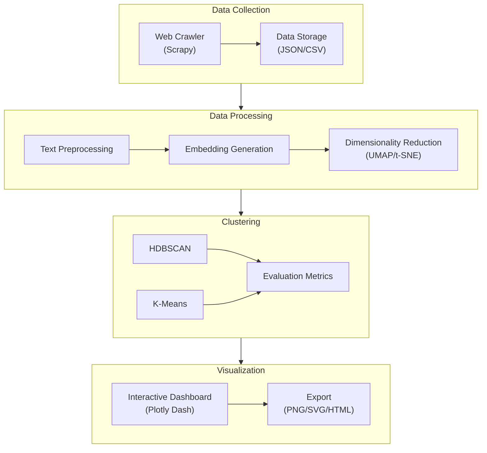
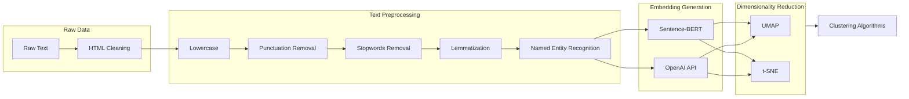
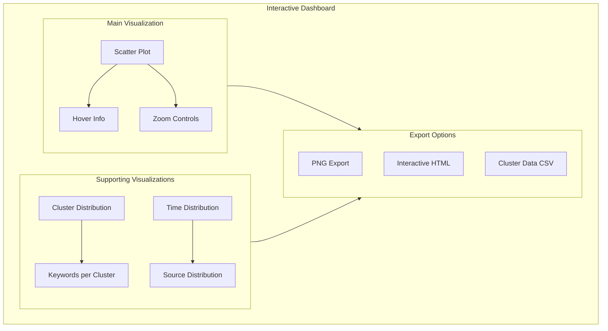

# Semantic Clustering for Topic Discovery - Experimental Design

## System Architecture Overview

## 1. Data Collection Strategy

### Web Crawler Design
- **Target Sources**: 
  - News websites (e.g., Reuters, AP News)
  - Review platforms (e.g., Amazon product reviews)
  - Blog platforms (e.g., Medium articles)
- **Crawler Implementation**:
  - Use Scrapy framework for robust, scalable crawling
  - Implement polite crawling with delays and respect robots.txt
  - Store data in structured format (JSON/CSV)
- **Data Fields to Collect**:
  - Article/review text content
  - Title
  - Publication date
  - Source URL
  - Category/tags (if available)
  - Author (if available)

### Data Volume Targets
- Minimum 10,000 documents for meaningful clustering
- Balanced distribution across sources
- Time span: Last 6 months of content

## 2. Data Processing Pipeline

### Data Processing Flow Diagram

### Text Preprocessing
1. **Cleaning**:
   - Remove HTML tags
   - Handle special characters
   - Remove excessive whitespace
   - Fix common encodings issues

2. **Text Normalization**:
   - Lowercase conversion
   - Punctuation removal
   - Stop words removal
   - Lemmatization
   - Named entity recognition (optional)

### Embedding Generation
1. **Model Selection**:
   - Primary: Sentence-BERT (specifically 'all-mpnet-base-v2')
   - Alternative: OpenAI embeddings API
   
2. **Embedding Strategy**:
   - Generate document-level embeddings
   - Dimension: 768 (SBERT) or 1536 (OpenAI)
   - Batch processing for efficiency

## 3. Clustering Approach

### Dimensionality Reduction
1. **UMAP Configuration**:
   - n_neighbors: 15
   - min_dist: 0.1
   - n_components: 2 (for visualization)
   - metric: 'cosine'

2. **t-SNE Alternative**:
   - perplexity: 30
   - n_iter: 1000
   - learning_rate: 200

### Clustering Methods

1. **Primary: HDBSCAN**
   - min_cluster_size: 50
   - min_samples: 5
   - metric: 'euclidean'
   - cluster_selection_epsilon: 0.5

2. **Alternative: K-Means**
   - Determine optimal k using elbow method
   - Range: sqrt(n/2) to sqrt(n)
   - Multiple initializations (n_init=10)

## 4. Evaluation Metrics

### Clustering Quality
- Silhouette Score
- Davies-Bouldin Index
- Calinski-Harabasz Index
- Topic coherence (if using topic modeling)

### Topic Quality
- Manual evaluation of sample clusters
- Inter-cluster distance
- Intra-cluster similarity

## 5. Visualization Strategy

### Dashboard Layout

### Interactive Dashboard (Plotly Dash)
1. **Main Visualization**:
   - 2D scatter plot of reduced dimensions
   - Color-coded clusters
   - Hover information with sample text
   - Zoom and selection capabilities

2. **Supporting Visualizations**:
   - Cluster size distribution
   - Top keywords per cluster
   - Time distribution of documents
   - Source distribution

### Export Capabilities
- PNG/SVG export
- Interactive HTML
- Cluster data in CSV/JSON

## 6. Implementation Plan

### Project Timeline

```mermaid
gantt
    title Implementation Timeline
    dateFormat  W
    axisFormat %d
    
    section Data Collection
    Crawler Setup      :w1, 0, 1w
    Data Collection    :w2, after w1, 1w
    
    section Processing
    Text Preprocessing :w3, after w2, 1w
    
    section Clustering
    Algorithm Implementation :w4, after w3, 1w
    
    section Visualization
    Dashboard Development   :w5, after w4, 1w
    
    section Documentation
    Testing & Documentation :w6, after w5, 1w
```

### Phase 1: Data Collection (Week 1-2)
- Set up crawler infrastructure
- Implement data collection
- Quality checks and storage

### Phase 2: Processing Pipeline (Week 3)
- Text preprocessing
- Embedding generation
- Initial dimensionality reduction

### Phase 3: Clustering (Week 4)
- Implement clustering algorithms
- Parameter tuning
- Evaluation metrics

### Phase 4: Visualization (Week 5)
- Dashboard development
- Interactive features
- Export functionality

### Phase 5: Documentation & Testing (Week 6)
- Code documentation
- Performance testing
- User guide creation

## 7. Technical Stack

### Core Technologies
- Python 3.9+
- Scrapy for crawling
- Sentence-Transformers
- scikit-learn
- UMAP-learn
- HDBSCAN
- Plotly Dash

### Development Tools
- Git for version control
- Docker for containerization
- Poetry for dependency management
- Black for code formatting
- Pytest for testing

## 8. Expected Outcomes

### Deliverables
1. Cleaned dataset of documents
2. Trained embedding models
3. Clustering results
4. Interactive visualization dashboard
5. Technical documentation
6. Evaluation report

### Success Metrics
- Minimum 80% clustering coverage
- Silhouette score > 0.5
- Clear topic separation in visualizations
- Processing time < 1 hour for 10k documents 